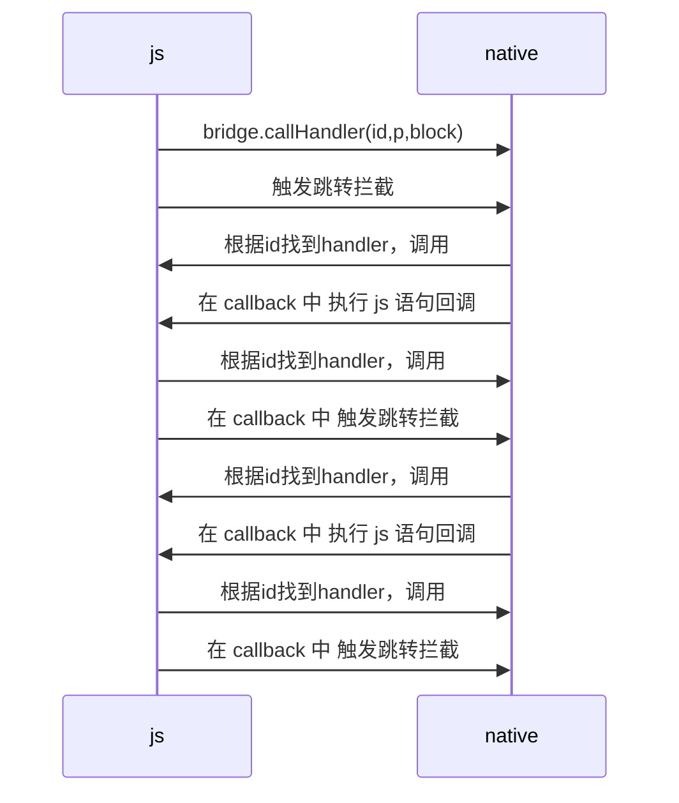

WebViewJavascriptBridge 通信的原理主要是通过 拦截跳转；

##### 前提：

-> native create webview;
-> 创建 native bridge；
-> native 注册 handler；包括(id, param, callback); native bridge 会存储起来；
-> 加载 html；
-> html 首先要触发一个跳转；  
-> webview 拦截，然后注入 js bridge；
-> js 注册 handler；包括(id, param, callback); js bridge 会存储 handler；

##### 通信过程

-> js 调用 native 
-> jsbridge.callHandler(id, param, callback) 
-> jsbridge 将参数封装为 msg(dict)，放入 msg 队列
-> 触发跳转拦截
-> webview 通过执行 jsbridge 特定方法，拿到 msgs(就是一个字符串)
-> native 解析 msgs，根据id找到对应的 native handler，然后调用
-> native handler 调用后会触发 callback block
-> callback block 内封装一条msg，封装一条js语句(call jsbridge.\_handleMessageFromObjC)
-> 执行js
-> js 根据id 找到 handler，然后调用
-> js handler 调用后会触发 callback block
...




这可以是一个无线循环；


##### 代码

```
bridge.callHandler('testObjcCallback', {'foo': 'bar'}, function(response) {
    log('JS got response', response)
}

function callHandler(handlerName, data, responseCallback) {
    _doSend({ handlerName:handlerName, data:data }, responseCallback);
}

function _doSend(message, responseCallback) {
    if (responseCallback) { // 将回调方法存入 dict 中
        var callbackId = 'cb_'+(uniqueId++)+'_'+new Date().getTime();
        responseCallbacks[callbackId] = responseCallback;
        message['callbackId'] = callbackId;
    }
    // msg 加入队列
    sendMessageQueue.push(message); 
    // 触发跳转
    messagingIframe.src = CUSTOM_PROTOCOL_SCHEME + '://' + QUEUE_HAS_MESSAGE;
}
// 跳转拦截
- (void)webView:(WKWebView *)webView decidePolicyForNavigationAction:(WKNavigationAction *)navigationAction decisionHandler:(void (^)(WKNavigationActionPolicy))decisionHandler {

    [self WKFlushMessageQueue]; 
}
// 调用 WebViewJavascriptBridge._fetchQueue()，拿到所有msg
- (void)WKFlushMessageQueue {
    [_webView evaluateJavaScript:[_base webViewJavascriptFetchQueyCommand] completionHandler:^(NSString* result, NSError* error) {
        [_base flushMessageQueue:result];
    }];
}
// 遍历 msgs，根据msg.id 找到 native.handler，调用
// 添加 handler callback
// 在 callback 中告诉 js 执行结果 
- (void)flushMessageQueue:(NSString *)messageQueueString{
    id messages = [self _deserializeMessageJSON:messageQueueString];
    for (WVJBMessage* message in messages) {
        
        NSString* responseId = message[@"responseId"];
        if (responseId) {
            WVJBResponseCallback responseCallback = _responseCallbacks[responseId];
            responseCallback(message[@"responseData"]);
            [self.responseCallbacks removeObjectForKey:responseId];
        } else {
            WVJBResponseCallback responseCallback = NULL;
            NSString* callbackId = message[@"callbackId"];
            if (callbackId) {
                responseCallback = ^(id responseData) {
                    if (responseData == nil) {
                        responseData = [NSNull null];
                    }
                    
                    // 执行js
                    WVJBMessage* msg = @{ @"responseId":callbackId, @"responseData":responseData };
                    [self _queueMessage:msg];
                };
            } else {
                responseCallback = ^(id ignoreResponseData) {
                    // Do nothing
                };
            }
            
            WVJBHandler handler = self.messageHandlers[message[@"handlerName"]];
            handler(message[@"data"], responseCallback);
        }
    }
}
// js 端，拿到 native msg
// msg.id 找到 handler，然后调用
// 同样 封装 callback，然后调用，告诉 native 执行结果
function _dispatchMessageFromObjC(messageJSON) {
    if (dispatchMessagesWithTimeoutSafety) {
        setTimeout(_doDispatchMessageFromObjC);
    } else {
         _doDispatchMessageFromObjC();
    }
    
    function _doDispatchMessageFromObjC() {
        var message = JSON.parse(messageJSON);
        var messageHandler;
        var responseCallback;

        if (message.responseId) {
            // 找到 js handler，然后调用
            responseCallback = responseCallbacks[message.responseId];
            if (!responseCallback) {
                return;
            }
            responseCallback(message.responseData);// 调用回调
            delete responseCallbacks[message.responseId];
        } else {
            if (message.callbackId) {
                var callbackResponseId = message.callbackId;
                // 这里又提供了一个callback
                responseCallback = function(responseData) {
                    _doSend({ handlerName:message.handlerName, responseId:callbackResponseId, responseData:responseData });
                };
            }
            // 找到 js handler，然后调用
            var handler = messageHandlers[message.handlerName];
            if (!handler) {
                console.log("WebViewJavascriptBridge: WARNING: no handler for message from ObjC:", message);
            } else { // 调用js端方法
                handler(message.data, responseCallback);
            }
        }
    }
}

```

